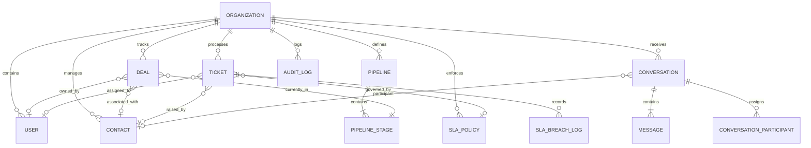

# EasyChat CRM — Database Schema & Architecture Guide

## Overview

The EasyChat data layer is built on PostgreSQL 15+ and managed through Prisma ORM. The relational model is designed for high transactional throughput, multi-tenant isolation, and relational integrity.

---

## 1. Core Domain Entity Relationship Diagram

---

## 2. Key Relational Models Reference

### 2.1 Multi-Tenant Isolation: `Organization`
The `Organization` table is the root boundary of all customer data. Every tenant-specific query is scoped by `organizationId`.

| Column | Type | Description |
|---|---|---|
| `id` | UUID (PK) | Unique organization identifier |
| `name` | String | Company or workspace name |
| `plan` | String | STARTER, PRO, ENTERPRISE |
| `timezone` | String | Primary operational timezone |
| `defaultCurrency`| String | Default ISO-4217 currency (USD, EUR, GBP) |
| `createdAt` | DateTime | Timestamp of creation |

### 2.2 Customer 360 Record: `Contact`
Represents an individual customer or business prospect across all sales and support channels.

| Column | Type | Index | Description |
|---|---|---|---|
| `id` | UUID (PK) | Primary | Unique contact ID |
| `organizationId` | UUID (FK) | B-Tree | Tenant isolation key |
| `firstName` | String | B-Tree | Contact first name |
| `lastName` | String | B-Tree | Contact last name |
| `email` | String | B-Tree | Primary email address |
| `phone` | String | B-Tree | E.164 phone number |
| `country` | String(2) | B-Tree | ISO 3166-1 alpha-2 country code |
| `leadScore` | Int | B-Tree | AI-computed lead engagement score (0–100) |
| `lifetimeValue` | Float | B-Tree | Aggregated revenue (LTV) |
| `tags` | String | GIN/Trgm | Comma-delimited classification tags |

### 2.3 Sales Engine: `Deal` & `Pipeline`
Tracks opportunities as they progress through sequential sales pipeline stages.

- `Deal.amount`: Numerical deal value in specified currency
- `Deal.status`: `OPEN`, `WON`, `LOST`
- `Deal.expectedCloseDate`: Forecast target date
- `PipelineStage.probability`: Stage win probability (0–100%) for weighted revenue forecasting

### 2.4 Support Ticketing & SLA: `Ticket` & `SlaPolicy`
Governs inbound customer support issues and resolution deadlines.

- `Ticket.priority`: `LOW`, `MEDIUM`, `HIGH`, `URGENT`
- `Ticket.status`: `OPEN`, `IN_PROGRESS`, `WAITING`, `RESOLVED`, `CLOSED`
- `SlaPolicy.firstResponseMinutes`: Maximum elapsed time to initial response
- `SlaPolicy.resolutionMinutes`: Maximum elapsed time to resolution
- `SlaBreachLog`: Records every SLA breach with overrun duration and target metrics

### 2.5 Omnichannel Communications: `Conversation` & `Message`
Normalized message storage across all communication channels (Email, WhatsApp, Live Chat, Phone).

- `Conversation.channel`: Communication medium
- `Message.content`: Text body of message
- `Message.metadata`: JSONB containing attachments, delivery status, and AI sentiment analysis

---

## 3. Database Indexing & Performance Strategy

1. **Compound Multi-Tenant Indexes**: `(organizationId, createdAt DESC)` on high-volume tables (`Message`, `AuditLog`, `Activity`) for fast timeline pagination.
2. **Trigram Search Indexes**: `pg_trgm` on `Contact(firstName, lastName, email)` for fuzzy auto-complete search.
3. **Foreign Key Indexes**: Every relation key (`contactId`, `dealId`, `assignedToId`) is indexed to eliminate table scans during joins.
